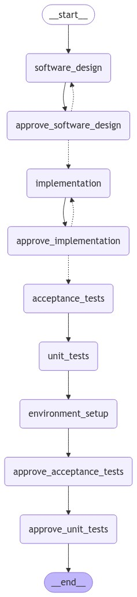

# autoSWE

Benchmarking the performance of automated software engineering against DevBench. 

The 5 evaluations in DevBench will serve as the primary nodes in the system. Progression to the next node is determined by hardcoded logic or an LLM in "approve_" prefixed nodes. 

Tasks/Nodes:
1. Software Design
2. Environment Setup
3. Implementation
4. Acceptance Testing
5. Unit Testing

### Control flow

We use langgraph to manage the control flow of the system. Decision nodes make decisions based on hard-coded rules or an LLM can be used to make the decision. They are prefixed with "approve_". They have conditional edges to route the flow of the system. 



In the graph `state` we accumulate "documents" produced by each node in the graph these are our final artifacts/outputs. 

## Examples

A `.env.` file is required (see .env.example). It should contain the following:

```bash
OPENAI_API_KEY="your key"
LANGCHAIN_API_KEY="your key"
LANGCHAIN_TRACING_V2="true"
LANGCHAIN_PROJECT="autoSWE-1"
LANGCHAIN_ENDPOINT="https://api.smith.langchain.com"
```

You will need to make an account at [Langchain](https://langchain.com). 

To point at a specific PRD.md file and run the full program:
```python
python main.py --prd_path path/to/PRD.md
```

Alternatively, you can run the example PRD.md file in the repo:

```python
python main.py
```

