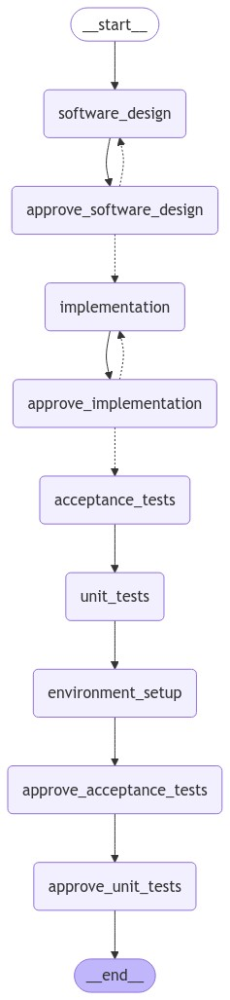
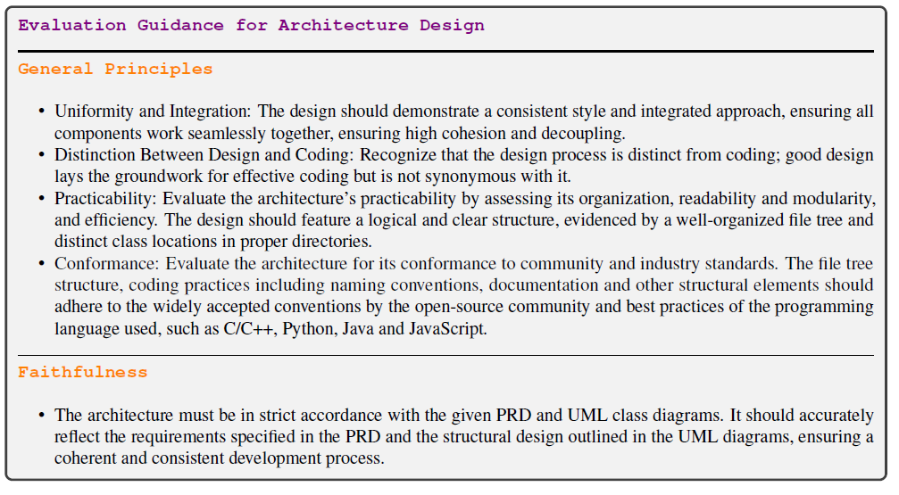

# autoSWE

* Using DevBench as the benchmark dataset to test against
* Focusing first on the python repositories

The 5 evaluations in DevBench will serve as the primary nodes in the system. Progression to the next node is determined by either a controller LLM or hardcoded logic. 

Tasks/Nodes:
1. Software Design
2. Environment Setup
3. Implementation
4. Acceptance Testing
5. Unit Testing

### Control flow

We use langgraph to manage the control flow of the system. Decision nodes make decisions based on hard-coded rules or an LLM can be used to make the decision. They are prefixed with "approve_". 

## Nodes of the Graph

Note: *Evaluation* is included below for each node so that we can keep it in mind, but it wouldn't be run until after everything's produced - it's just here for context on what the end goal is. 

### 1. Software Design

Context Inputs:
* PRD.md
 
Prompt/Task:
* Create UML class diagram using mermaid syntax called UML_class.md
* Create  UML sequence diagram using mermaid syntax called UML_sequence.md
* Create architecture design as a text based representation of the file tree call it architecture_design.md
 

Node Output:
* UML_class.md
* UML_sequence.md
* Architecture_design.md
 
Controller Decision to proceed:
* Controller decides to proceed using the same criteria as used in evaluation, the decision is subjective
 

*Evaluation*:
* LLM-as-a-judge (see paper appendix for criteria)
 

### 2. Environment

Context Inputs:
* PRD.md
* UML_class.md
* UML_sequence.md
* architecture_design.md
 

Prompt/Task:
* Given the inputs, generate a requirements.txt pip-style to satisfy all the expected dependencies
 

Node Output:
* Requirements.txt
* Setup_shell_script.sh (pip install -r requirements.txt)
 

Controller decision to proceed:
* Execute the pip install -requirements.txt
* Ask agent to fix requirements.txt based on any errors received
 

*Evaluation*:
* Success rate of requirements.txt even installing?
* Maybe count number of times to go back-and-forth making fixes if it doesn't work
* Success rate when invoking the LLM-produced requirements.txt and trying to run the benchmark repo example usage command
 

### 3. Implementation

Context Inputs:
* PRD.md
* UML_class.md
* UML_sequence.md
* architecture_design.md
* Requirements.txt
 

Prompt/task:
* Given the inputs, follow the file hieararchy in the architecture design and write each script one-at-a-time
* Iterate over the hiearchy and ask agent to write that specific script
    * Explore the possibility of generating a DAG to control development sequence
* Write unit tests for each script as needed
    * Execute the tests
        * Double-back and make edits to the script if the unit tests fail
    * Maximum of n tries
* Save unit test result
* Run pylint on each script
    * Double-back and make edits to the script if pylint fails
* Execute unit tests to make sure nothing's broken
 

Node Output:
* Report the actual file hiearchy (generated by using a shell command)
* Report the unit test results
* Report the pylint results
 

Controller decision to proceed:
* Controller checks that file hierarchy matches the architecture_design.md
 

*Evaluation*:
* Execute pre-determined acceptance test
* Execute pre-determined unit test

### 4. Acceptance Testing

Context Inputs:
* PRD.md
* UML_class.md
* UML_sequence.md
* architecture_design.md
* Source code files concatenated? Chunked?
 

Prompt/Task:
* Given the inputs, generate appropriate acceptance tests ensuring the software adheres to requirements in the PRD
* The acceptance tests must contain the test input (command to execute) and the expected output
 

Node Output:
* The result of the acceptance test
 

Controller decision to proceed:
* If node.output == True then proceed
* Ask agent to fix code or acceptance test if it fails
 

*Evaluation*:
* Execute the LLM-generated acceptance tests against the benchmark source doe
* Compare the LLM's expected output to the realized output when running the test command on the benchmark repo (not on the LLM's repo)
 

### 5. Unit Testing

Context Inputs:
* PRD.md
* UML_class.md
* UML_sequence.md
* architecture_design.md
* Source code files concatenated? Chunked?
 

Prompt/Task:
* Given the inputs, generate unit tests along the critical path of execution for this repository
 

Node Output:
* Report the unit test results
* Report the coverage of the unit tests
 

Controller/Graph decision to proceed:
* Unit test 100% pass rate
* Coverage > 75%?
 

*Evaluation*:
* Execute the LLM-generated unit tests on the benchmark source code
    * I thought the paper tested the other way around?
