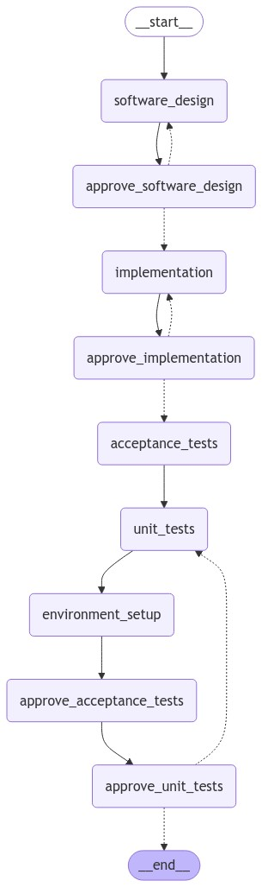

# autoSWE

AutoSWE is a system for producing entire code repositories from a PRD.md file. It is designed to produce the artifacts necessary for the [DevBench ](https://github.com/open-compass/DevBench) benchmark which was established to evaluate the effectiveness of LLM-based code generation. It differs from typical evaluations of LLM-coding systems in that it is designed to evaluate the entire software engineering process, not just bug fixes or code completion.

DevBench has five evaluation tasks:

1. Software Design
2. Environment Setup
3. Implementation
4. Acceptance Testing
5. Unit Testing


We have implemented a system that can automatically generate the artifacts for these tasks. The system uses LangGraph to orchestrate the control flow of the system and the artifacts are accumulated in a `state` object. We use Pydantic to validate for structured outputs of the LLMs for each task - such as requesting dictionaries with specific keys. The system will also check for and handle installing necessary dependencies to run the code it generates.

We use LangChain, LangGraph, and LangSmith for tracing the OpenAI API calls and the `state` of the system. We use GPT-4o as the LLM.

### Control flow

We use langgraph to manage the control flow of the system and nodes prefixed with "approve_" evaluate the documents/code and either approve the documents/code or circle back with a message regarding what is incorrect. They have conditional edges to route the flow of the system. 



In the graph `state` we accumulate "documents" produced by each node in the graph these are our final artifacts/outputs. 

## Examples

A `.env.` file is required (see .env.example). It should contain the following:

```bash
OPENAI_API_KEY="your key"
LANGCHAIN_API_KEY="your key"
LANGCHAIN_TRACING_V2="true"
LANGCHAIN_PROJECT="autoSWE-1"
LANGCHAIN_ENDPOINT="https://api.smith.langchain.com"
```

You will need to make an account at [Langchain](https://langchain.com). 

To point at a specific PRD.md file and run the full program:
```python
python main.py --prd_path path/to/PRD.md
```

Alternatively, you can run the example PRD.md file in the repo:

```python
python main.py --out_path outputs/sample.json
```

